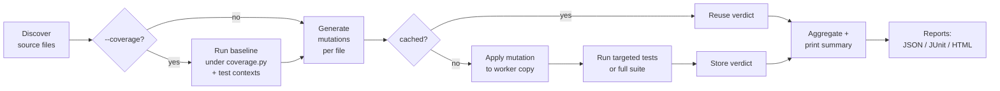
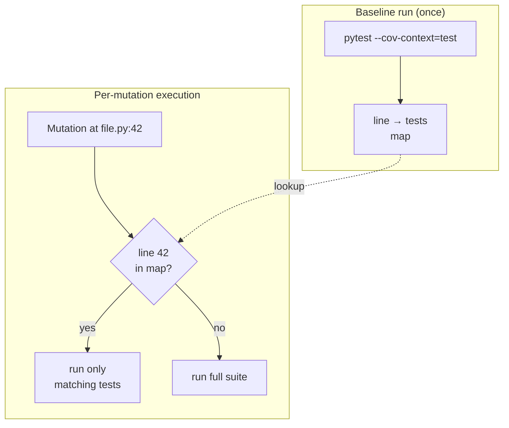
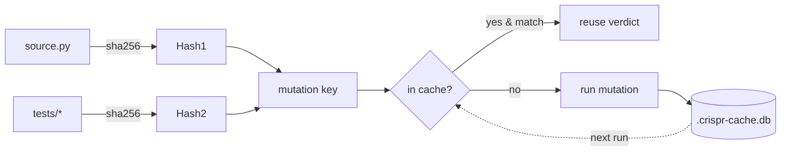
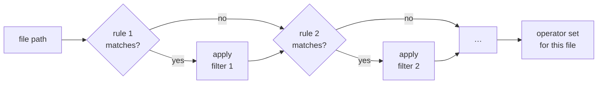

# crispr

**Fast, AST-based mutation testing for Python.**

A drop-in alternative to [mutmut](https://github.com/boxed/mutmut) and
[cosmic-ray](https://github.com/sixty-north/cosmic-ray) focused on speed,
incremental runs, and coverage-driven test targeting.

- 🌳 **Pure AST** — no regex hacks, no source-level string replacement.
- ⚡ **Coverage-targeted execution** — runs only the tests that actually
  exercise each mutated line (via `coverage.py` dynamic contexts).
- 🧠 **Incremental cache** — SQLite-backed; unchanged source/tests reuse
  prior verdicts.
- 🧵 **Parallel workers** — N isolated copies of the project run mutations
  concurrently.
- 🎯 **30+ mutation operators** — arithmetic, comparison, boolean, control
  flow, exception handling, decorators, defaults, comprehensions, async, …
- 📋 **Per-file rules** — turn operators on/off per glob pattern.
- 📊 **Reports** — JSON, JUnit XML, and a dark-themed HTML dashboard.

---

## Installation

```bash
pip install -e .
# or, with uv:
uv pip install -e .
```

For coverage-targeted runs, install `coverage` (and ideally `pytest-cov`):

```bash
pip install coverage pytest-cov
```

---

## Quick start

```bash
# Default: pytest -x -q --tb=no --no-header, sequential, no coverage
crispr run .

# Custom test command
crispr run . -c "pytest tests/ -x -q"

# 8 parallel workers, coverage-targeted, with reports
crispr run . -j 8 --coverage --source-dirs src/ \
       --json report.json --html report.html

# Limit to a subset of operators (positive list)
crispr run . -o arithmetic -o comparison -o negate_condition

# Dry run — list mutations without executing tests
crispr run . --dry-run

# Debug — print per-file mutation breakdown + funnel stats
crispr run . --debug
```

---

## How it works

Crispr's pipeline is a 5-stage process. The **coverage** and **cache**
shortcuts are what make it fast on incremental runs.



### Coverage-targeted execution

When `--coverage` is on, crispr runs the suite once under
`coverage.py --dynamic-context=test_function` (or `pytest-cov
--cov-context=test`). This builds a **line → tests** map: for each
covered line, which tests touched it.

For each mutation, crispr launches **only** the tests that exercise that
line (and ±2 neighbouring lines, so guard conditions count). On a typical
codebase this is a 5–20× speedup vs running the full suite per mutation.



Lines never executed by any test are **skipped entirely** (no point
mutating dead code from the test suite's perspective).

### Incremental cache

Mutation verdicts, the coverage baseline, and source/test fingerprints
are stored in `.crispr-cache.db` (SQLite). On subsequent runs:



The same fingerprinting protects the **coverage baseline JSON**: change
no source or test, change no test command — and crispr reuses the
previous coverage map without re-running pytest.

### Parallel workers

With `-j N`, crispr creates `N` shallow copies of the project under
`.crispr/worker_*/` and dispatches mutations across them. Each worker
holds a single mutation at a time on its own filesystem copy, so workers
never see each other's mutations.

The `.crispr/` directory is wiped on exit (success, failure, or
`SIGINT`).

---

## Mutation operators

| Category   | Operator              | Example transformation                    |
|------------|-----------------------|-------------------------------------------|
| Arithmetic | `arithmetic`          | `a + b` → `a - b`                         |
|            | `bitwise`             | `a & b` → `a \| b`                        |
|            | `aug_assign`          | `x += 1` → `x -= 1`                       |
|            | `range_boundary`      | `range(10)` → `range(11)`                 |
| Logic      | `comparison`          | `x == y` → `x != y`                       |
|            | `comparison_boundary` | `x < y` → `x <= y`                        |
|            | `boolean`             | `a and b` → `a or b`                      |
|            | `negate_condition`    | `if x:` → `if not x:`                     |
|            | `unary`               | `-x` → `+x`, `not x` → `x`                |
| Values     | `constant`            | `42` → `43`, `True` → `False`             |
|            | `string_mutation`     | `"foo"` → `"XXfooXX"` / lower / upper     |
|            | `fstring`             | `f"x={x}"` → `f"{x}"`                     |
|            | `default_param`       | `def f(x=10)` → `def f(x=None)`           |
| Control    | `return`              | `return x` → `return None`                |
|            | `yield`               | `yield x` → `return`                      |
|            | `if_else_swap`        | swaps the bodies of `if/else`             |
|            | `ternary_swap`        | `a if c else b` → `b if c else a`         |
|            | `break_continue`      | `break` ↔ `continue`                      |
|            | `remove_await`        | `await f()` → `f()`                       |
| Statements | `stmt_deletion`       | any statement → `pass`                    |
|            | `assign_to_none`      | `x = expr` → `x = None`                   |
|            | `assert_removal`      | `assert cond` → `pass`                    |
|            | `decorator_removal`   | `@cache\ndef f(): ...` → `def f(): ...`   |
| Calls      | `call_arg`            | drop / swap arguments                     |
|            | `keyword_name`        | `f(timeout=…)` → `f(retries=…)`           |
|            | `string_method_swap`  | `"x".upper()` → `"x".lower()`             |
|            | `dict_method_swap`    | `d.get(k)` → `d.pop(k)`                   |
|            | `subscript`           | `xs[0]` → `xs[-1]`                        |
| Errors     | `exception_handler`   | `except E: …` → `except E: pass`          |
|            | `exception_widen`     | `except ValueError:` → `except Exception:`|
| Misc       | `comp_filter`         | `[x for x in xs if cond]` drops the `if`  |

Run `crispr run . --debug` to see the operator-by-operator breakdown for
your codebase:

```
  Mutants by operator (3433 total):
    string_mutation       566   23.8%
    constant              428   18.0%
    call_arg              371   15.6%
    stmt_deletion         320   13.4%
    assign_to_none        251   10.5%
    keyword_name          162    6.8%
    return                 61    2.6%
    ...
```

Plus the funnel of how files & lines whittle down through the pipeline:

```
  Source files:                  210
  Covered files (baseline):      150
  Mutable files (without rules): 145
  Mutable files (after rules):   140
  Covered lines (baseline):    13668
  Mutable lines (without rules): 1500
  Mutable lines (after rules):   1234
```

---

## Configuration (`pyproject.toml`)

All CLI flags can live in `[tool.crispr]`. CLI flags override the file.

```toml
[tool.crispr]
command = "pytest -x -q --tb=no --no-header"
timeout = 30
workers = 8
coverage = true
source_dirs = ["src/myproject"]
include = ["src/myproject"]
exclude = [".venv", "migrations", "infrastructure"]
ignore_patterns = [
    '^\s*log(ger|ging)?\.',  # don't flag survivors on logging-only lines
]
```

### Per-file rules

Rules let you turn operators on/off based on a glob. Use **gitignore
syntax** (via `pathspec`). `allowed_operators = []` disables mutations
entirely for matched files. Last matching rule wins.

```toml
# Domain layer: only test core logic operators
[[tool.crispr.rules]]
glob = "**/domain/**/*.py"
allowed_operators = ["arithmetic", "comparison", "boolean", "negate_condition", "return"]

# Settings/containers/__init__: skip noisy string mutations
[[tool.crispr.rules]]
glob = "**/{settings,container,constants,__init__}.py"
excluded_operators = ["string_mutation", "assign_to_none", "call_arg"]

# Generated code: don't touch
[[tool.crispr.rules]]
glob = "**/generated/**/*.py"
allowed_operators = []
```



### Skipping individual lines

```python
SECRET_KEY = "deadbeef"          # crispr: skip
PI = 3.14159                     # pragma: no mutate
```

---

## Subcommands

```
crispr run [path]      Run mutation testing
crispr show <id>       Show diff for a mutation by ID
crispr apply <id>      Apply a mutation to disk for debugging
crispr apply <id> --revert    Revert applied mutations from backup
crispr results         List cached mutation results
crispr results --survivors    Only show mutations that survived
crispr clear           Clear cache, workers, backups
```

### Inspecting a survivor

```bash
$ crispr results --survivors

  Surviving mutations (3):

  a1b2c3d4e5f6  survived  src/foo.py:42   [comparison] == → !=
  9f8e7d6c5b4a  survived  src/bar.py:17   [boolean]    and → or
  ...

$ crispr show a1b2c3d4e5f6
  Mutation  a1b2c3d4e5f6
  File:     src/foo.py:42
  Operator: comparison
  Desc:     == → !=
  Status:   survived

  --- src/foo.py
  +++ src/foo.py (mutated)
  @@ -40,7 +40,7 @@
  -    if user.role == "admin":
  +    if user.role != "admin":
```

### Reproducing a survivor locally

```bash
# Apply mutation to your working tree
crispr apply a1b2c3d4e5f6
# … add a test that should kill it, run pytest …
crispr apply a1b2c3d4e5f6 --revert
```

---

## CLI reference (`crispr run`)

| Flag                  | Default                              | Description                                       |
|-----------------------|--------------------------------------|---------------------------------------------------|
| `-c, --command`       | `pytest -x -q --tb=no --no-header`   | Test command                                      |
| `-j, --workers`       | `1`                                  | Parallel workers                                  |
| `-i, --include`       | —                                    | Only mutate files matching these substrings       |
| `-e, --exclude`       | —                                    | Skip these directory names                        |
| `-o, --operators`     | all                                  | Restrict to these operators                       |
| `-t, --timeout`       | `30`                                 | Per-mutation timeout (seconds)                    |
| `--config`            | `./pyproject.toml`                   | Config file path                                  |
| `--coverage`          | off                                  | Use `coverage.py` to skip uncovered lines + map tests |
| `--source-dirs`       | —                                    | Coverage source directories                       |
| `--no-baseline`       | off                                  | Don't run the suite once before mutating          |
| `--no-cache`          | off                                  | Disable the SQLite cache                          |
| `--json FILE`         | —                                    | Write JSON report                                 |
| `--html FILE`         | —                                    | Write HTML dashboard                              |
| `--junit FILE`        | —                                    | Write JUnit XML (for CI)                          |
| `-q, --quiet`         | off                                  | Summary only (no progress bar)                    |
| `--debug`             | off                                  | Per-file mutation listing + operator breakdown    |
| `--dry-run`           | off                                  | List mutations and exit                           |

---

## Reports

### JSON

```json
{
  "summary": {"total": 3433, "killed": 2890, "survived": 412, "timeout": 18, "error": 5, "ignored": 108},
  "duration_s": 1247.3,
  "mutations": [
    {"id": "a1b2c3d4e5f6", "file": "src/foo.py", "lineno": 42,
     "operator": "comparison", "description": "== → !=",
     "status": "survived", "duration_s": 0.8}
  ]
}
```

### HTML

A standalone, dependency-free dark-themed dashboard with:

- Per-file kill/survive bars
- Sortable mutation table
- Inline diff for each survivor
- Aggregated operator stats

### JUnit XML

CI-friendly. Each mutation is a `<testcase>`; survivors are
`<failure>`; timeouts/errors are `<error>`. Drop into Jenkins / GitLab
CI / GitHub Actions for trend tracking.

---

## CI integration

```yaml
# .github/workflows/mutation.yml
- name: Mutation testing
  run: |
    pip install -e . pytest-cov
    crispr run . -j 4 --coverage --source-dirs src/ \
           --junit mutation.xml --html report.html

- uses: actions/upload-artifact@v4
  with: { name: mutation-report, path: report.html }

- uses: mikepenz/action-junit-report@v4
  with: { report_paths: 'mutation.xml' }
```

---

## License

MIT
